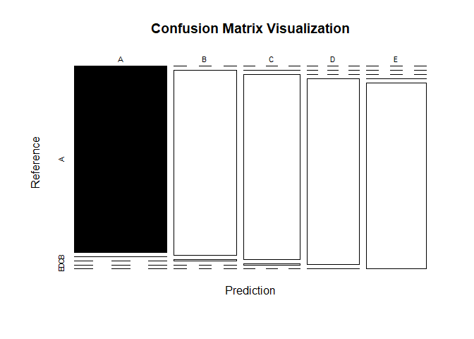
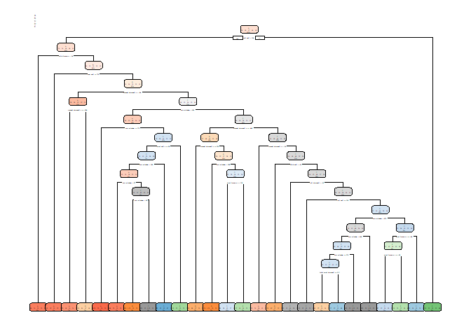
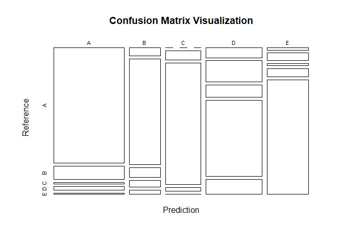

# Prediction Assignment Writeup
Ylli Prifti  
10 July 2017  

## Introduction
#### (From coursera assignment)
One thing that people regularly do is quantify how much of a particular activity they do, but they rarely quantify how well they do it. In this project, your goal will be to use data from accelerometers on the belt, forearm, arm, and dumbell of 6 participants.
### Background
Using devices such as Jawbone Up, Nike FuelBand, and Fitbit it is now possible to collect a large amount of data about personal activity relatively inexpensively. These type of devices are part of the quantified self movement – a group of enthusiasts who take measurements about themselves regularly to improve their health, to find patterns in their behavior, or because they are tech geeks. One thing that people regularly do is quantify how much of a particular activity they do, but they rarely quantify how well they do it. In this project, your goal will be to use data from accelerometers on the belt, forearm, arm, and dumbell of 6 participants. They were asked to perform barbell lifts correctly and incorrectly in 5 different ways. More information is available from the website here: http://groupware.les.inf.puc-rio.br/har (see the section on the Weight Lifting Exercise Dataset).
### Data
The training data for this project are available here:
https://d396qusza40orc.cloudfront.net/predmachlearn/pml-training.csv
The test data are available here:
https://d396qusza40orc.cloudfront.net/predmachlearn/pml-testing.csv
The data for this project come from this source: http://groupware.les.inf.puc-rio.br/har. If you use the document you create for this class for any purpose please cite them as they have been very generous in allowing their data to be used for this kind of assignment.
### Getting the data
We will download the data local if not present and will load data from local storage for efficency

```r
starttime <- Sys.time()

trainingUrl <- "https://d396qusza40orc.cloudfront.net/predmachlearn/pml-training.csv"
testingUrl  <- "https://d396qusza40orc.cloudfront.net/predmachlearn/pml-testing.csv"
trainingfile <- "trainingdata.csv"
testingfile  <- "testingdata.csv"
if(!file.exists(trainingfile))
  download.file(trainingUrl, trainingfile)
if(!file.exists(testingfile))
  download.file(testingUrl, testingfile)
trainingdata <- read.csv(trainingfile, na.strings=c("NA", "#DIV/0!"))
testingdata <- read.csv(testingfile, na.strings=c("NA", "#DIV/0!"))

dim(trainingdata)
```

```
## [1] 19622   160
```

```r
dim(testingdata)
```

```
## [1]  20 160
```

## Cleaning and cleansing the data
Now that the data have been loaded in our local datasets we decide to remove empty cells and unwanted information.
We are going to remove username information and time stamps.
We are going to remove N/A columns. We are also goint to remove any invariant columns (where the value doesn't change.)

```r
library(dplyr)
trainingdata$user_name <- NULL
trainingdata$X  <- NULL

testingdata$user_name <- NULL
testingdata$X <- NULL

trainingdata <- select(trainingdata, -contains("timestamp"))
testingdata <- select(testingdata, -contains("timestamp"))

columnnames <- sapply(trainingdata, function(x) all(is.na(x) || is.null(x)))

training <- trainingdata[, !columnnames]
testing <- testingdata[, !columnnames]

dim(training)
dim(testing)
```
## Random Forest 

Based on lectures and the type of data we are dealing with, we expect Random Forest to be performing good so we try RF first.

The same training and testing partition will be used from all models. 

We will start by creating the two sets for training and testing.

```r
library(caret)
```

```
## Warning: package 'caret' was built under R version 3.4.1
```

```
## Loading required package: lattice
```

```
## Loading required package: ggplot2
```

```r
library(randomForest)
```

```
## Warning: package 'randomForest' was built under R version 3.4.1
```

```
## randomForest 4.6-12
```

```
## Type rfNews() to see new features/changes/bug fixes.
```

```
## 
## Attaching package: 'randomForest'
```

```
## The following object is masked from 'package:ggplot2':
## 
##     margin
```

```
## The following object is masked from 'package:dplyr':
## 
##     combine
```

```r
set.seed(9999)
inTraining <- createDataPartition(training$classe, p=0.7, list=F)
trainingPart <- training[inTraining, ]
testingPart <- training[-inTraining, ]

dim(trainingPart)
```

```
## [1] 13737    55
```

```r
dim(testingPart)
```

```
## [1] 5885   55
```

Next step, we want to train a Random Forest network using "trainingPart", then test the prediction performance using "testingPart". We will then evaluate the accuracy and move to the next model.


```r
#rf <- train(classe ~ ., data = trainingPart, method = 'rf', verbose = T, allowParallel = T)
rf <- randomForest(classe ~ . , data=trainingPart, importance=TRUE, ntree=500, na.action = na.roughfix, allowParallel = T)

rf
```

```
## 
## Call:
##  randomForest(formula = classe ~ ., data = trainingPart, importance = TRUE,      ntree = 500, allowParallel = T, na.action = na.roughfix) 
##                Type of random forest: classification
##                      Number of trees: 500
## No. of variables tried at each split: 7
## 
##         OOB estimate of  error rate: 0.31%
## Confusion matrix:
##      A    B    C    D    E  class.error
## A 3905    1    0    0    0 0.0002560164
## B    9 2648    1    0    0 0.0037622272
## C    0   12 2382    2    0 0.0058430718
## D    0    0   10 2242    0 0.0044404973
## E    0    0    0    7 2518 0.0027722772
```

```r
p <- predict(rf, newdata = testingPart)

cm <- confusionMatrix(p, testingPart$classe)

cm
```

```
## Confusion Matrix and Statistics
## 
##           Reference
## Prediction    A    B    C    D    E
##          A 1674    4    0    0    0
##          B    0 1134    9    0    0
##          C    0    1 1017    6    0
##          D    0    0    0  956    1
##          E    0    0    0    2 1081
## 
## Overall Statistics
##                                           
##                Accuracy : 0.9961          
##                  95% CI : (0.9941, 0.9975)
##     No Information Rate : 0.2845          
##     P-Value [Acc > NIR] : < 2.2e-16       
##                                           
##                   Kappa : 0.9951          
##  Mcnemar's Test P-Value : NA              
## 
## Statistics by Class:
## 
##                      Class: A Class: B Class: C Class: D Class: E
## Sensitivity            1.0000   0.9956   0.9912   0.9917   0.9991
## Specificity            0.9991   0.9981   0.9986   0.9998   0.9996
## Pos Pred Value         0.9976   0.9921   0.9932   0.9990   0.9982
## Neg Pred Value         1.0000   0.9989   0.9981   0.9984   0.9998
## Prevalence             0.2845   0.1935   0.1743   0.1638   0.1839
## Detection Rate         0.2845   0.1927   0.1728   0.1624   0.1837
## Detection Prevalence   0.2851   0.1942   0.1740   0.1626   0.1840
## Balanced Accuracy      0.9995   0.9969   0.9949   0.9957   0.9993
```

```r
plot(cm$table, col = cm$byClass, main = paste("Confusion Matrix Visualization"))
```

<!-- -->

### Overall accuracy for Random Forest is 0.9960918


## Decision Tree


```r
library(rpart)
library(rpart.plot)
```

```
## Warning: package 'rpart.plot' was built under R version 3.4.1
```

```r
#library(rattle)
dt <- rpart(classe ~ ., data=trainingPart)

rpart.plot(dt)
```

```
## Warning: labs do not fit even at cex 0.15, there may be some overplotting
```

<!-- -->

```r
p <- predict(dt, newdata = testingPart, type="class")

cm <- confusionMatrix(p, testingPart$classe)

cm
```

```
## Confusion Matrix and Statistics
## 
##           Reference
## Prediction    A    B    C    D    E
##          A 1507  176   20   44   17
##          B   47  622   57   39   26
##          C    0   60  803   23    2
##          D  103  224  129  794  157
##          E   17   57   17   64  880
## 
## Overall Statistics
##                                           
##                Accuracy : 0.7827          
##                  95% CI : (0.7719, 0.7931)
##     No Information Rate : 0.2845          
##     P-Value [Acc > NIR] : < 2.2e-16       
##                                           
##                   Kappa : 0.7252          
##  Mcnemar's Test P-Value : < 2.2e-16       
## 
## Statistics by Class:
## 
##                      Class: A Class: B Class: C Class: D Class: E
## Sensitivity            0.9002   0.5461   0.7827   0.8237   0.8133
## Specificity            0.9390   0.9644   0.9825   0.8754   0.9677
## Pos Pred Value         0.8543   0.7863   0.9043   0.5643   0.8502
## Neg Pred Value         0.9595   0.8985   0.9554   0.9620   0.9584
## Prevalence             0.2845   0.1935   0.1743   0.1638   0.1839
## Detection Rate         0.2561   0.1057   0.1364   0.1349   0.1495
## Detection Prevalence   0.2997   0.1344   0.1509   0.2391   0.1759
## Balanced Accuracy      0.9196   0.7552   0.8826   0.8495   0.8905
```

```r
plot(cm$table, col = cm$byClass, main = paste("Confusion Matrix Visualization"))
```

<!-- -->

### Overall accuracy for Decision Trees is 0.7826678

Random Forest is far better than decision trees.

## Running random forest with the test data


```r
### Fix not matching columns 
common <- intersect(names(training), names(testing))
for (p in common) { if (class(training[[p]]) == "factor") { levels(testing[[p]]) <- levels(training[[p]]) } }
### End Fix 

testing$classe <- predict(rf, newdata = testing)
testing$classe
```

```
##  [1] B A B A A E D B A A B C B A E E A B B B
## Levels: A B C D E
```

```r
endtime <- Sys.time()

endtime - starttime
```

```
## Time difference of 6.713028 mins
```

```r
endtime
```

```
## [1] "2017-07-17 19:31:20 BST"
```

